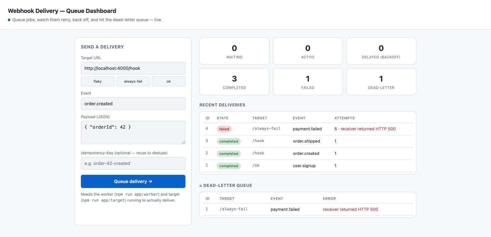

# Learn Message Queues in TypeScript

A hands-on, runnable project for understanding message queues — from building a
tiny queue **from scratch** to running a real feature on **BullMQ + Redis**.

Every phase is a small script you can run and read. No build step: modern Node
runs the TypeScript directly.

## Prerequisites

- **Node.js 22+** (uses native `.ts` execution)
- **Redis** running locally on `localhost:6379` (needed from Phase 2 on)
  ```bash
  # macOS:      brew install redis && brew services start redis
  # Docker:     docker run -d -p 6379:6379 redis
  # check it:   redis-cli ping   # → PONG
  ```

## Setup

```bash
git clone https://github.com/swapnull-in/messaging-queues.git
cd messaging-queues
npm install
```

## The lessons

Run them in order. Each one prints a timestamped log so you can watch what happens.

| Command | What you learn |
|---|---|
| `npm run phase1` | Build a queue **from scratch** — producer, consumer, ack, retry, dead-letter |
| `npm run phase2:demo` | The same app on **BullMQ + Redis** (persistent, distributed) |
| `npm run phase3` | **Idempotency** — safely handling a message that arrives twice |
| `npm run phase4` | **Scheduling** — delayed, repeatable (cron), and rate-limited jobs |
| `npm run phase5` | **RabbitMQ** — exchanges & routing: one event fanned out to many queues |
| `npm run phase6` | **Kafka-style streaming** — the log, consumer groups, offsets, replay |
| `npm run phase7` | **Pub/Sub** — fire-and-forget broadcast (no persistence, no acks) |
| `npm run phase8` | **Priority queues** — urgent jobs jump the line |

The code in `src/phase1/queue.ts` is the one to read first — it's the whole
queue engine in ~150 commented lines.

> **Phase 5 needs RabbitMQ** on `localhost:5672`:
> ```bash
> # macOS:   brew install rabbitmq && brew services start rabbitmq
> # Docker:  docker run -d -p 5672:5672 rabbitmq
> ```
> It shows what a job queue like BullMQ *doesn't* do: publishing to an
> **exchange** that routes one message to many subscriber queues by pattern.
>
> **Phase 6 needs a Kafka broker** on `localhost:9092`. Redpanda is a
> single-container, Kafka-compatible option:
> ```bash
> docker run -d --name redpanda -p 9092:9092 \
>   docker.redpanda.com/redpandadata/redpanda:latest \
>   redpanda start --mode dev-container
> ```
> It shows the log-based model: messages are *retained*, so many consumer
> groups can read (and replay) the same stream at their own offset.

### Two families of tools

- **Job queues** (Phases 1–4, 8; BullMQ) — deliver each message to *one* worker,
  then delete it. For background *work*: emails, webhooks, image processing.
- **Event brokers / streams** (Phases 5–7; RabbitMQ, Kafka, Pub/Sub) — distribute
  *events* to many independent consumers. For *notifying* other systems.

### Phase 2 the "real" way (two terminals)

```bash
npm run phase2:worker    # terminal 1 — the worker, leave it running
npm run phase2:produce   # terminal 2 — sends jobs, then exits
```

## Capstone: a real feature + dashboard

A **Webhook Delivery Service** — an API that accepts requests and returns
instantly, while a worker delivers them in the background with retries, backoff,
and a dead-letter queue. This is the classic reason queues exist.

Run the three parts in three terminals:

```bash
npm run app:target    # a fake, flaky receiver on :4000
npm run app:worker    # the delivery worker
npm run app:server    # the API + dashboard on :3000
```

Then open **http://localhost:3000/** to try it in the browser: send deliveries,
watch them retry and back off live, and see failed ones land in the dead-letter
queue.



Prefer curl?

```bash
curl -X POST localhost:3000/webhooks -H 'content-type: application/json' \
  -d '{"url":"http://localhost:4000/hook","event":"order.created","payload":{"orderId":42}}'
```

## Project layout

```
src/
  phase1/   queue built from scratch (+ demo)
  phase2/   same app on BullMQ + Redis
  phase3/   idempotency
  phase4/   scheduling
  phase5/   RabbitMQ — exchanges & routing
  phase6/   Kafka-style streaming (Redpanda)
  phase7/   Redis Pub/Sub
  phase8/   priority queues
  app/      the webhook delivery service + browser dashboard
```

## License

MIT — see [LICENSE](LICENSE). Use it, fork it, learn from it.
